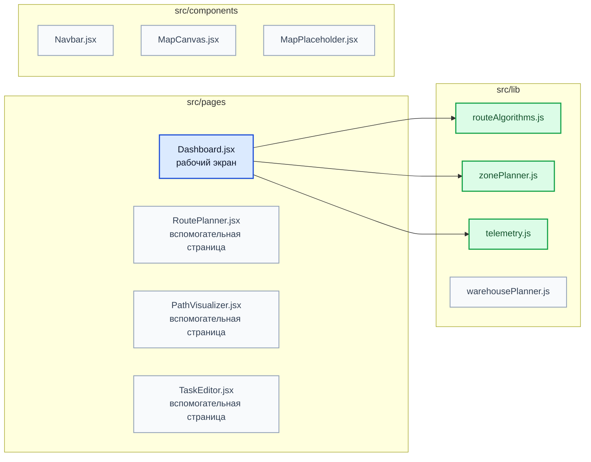
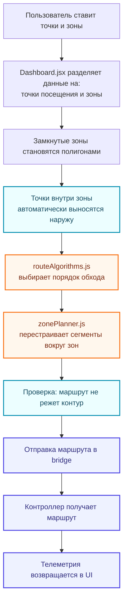
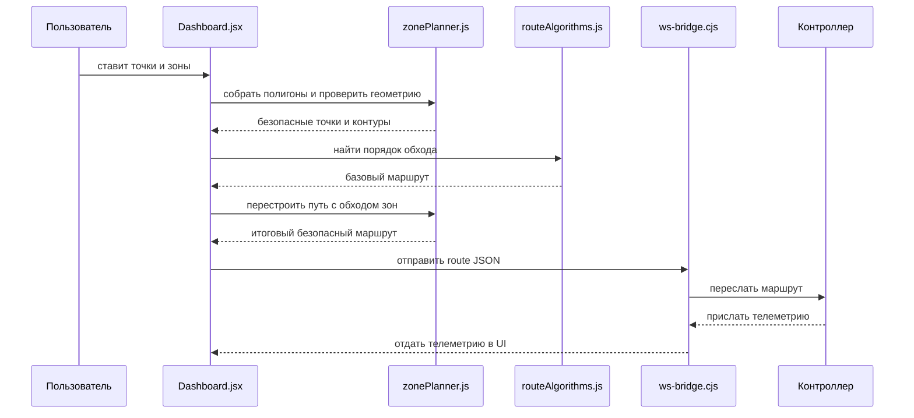

# Схема проекта GPO

Эта страница нужна, чтобы быстро и наглядно понять весь проект целиком: что в нем является интерфейсом, где лежит логика маршрута, как работают зоны, через что идет обмен данными и какие файлы сейчас реально участвуют в основном сценарии.

## 1. Общая схема проекта

```mermaid
flowchart TB
    user["Пользователь"]

    subgraph ui["Frontend / React"]
        main["main.jsx"]
        app["App.jsx"]
        dash["Dashboard.jsx<br/>главный экран и оркестрация"]
    end

    subgraph logic["Логика построения"]
        alg["routeAlgorithms.js<br/>порядок обхода точек"]
        geo["zonePlanner.js<br/>геометрия, полигоны, обход зон"]
    end

    subgraph transport["Обмен данными"]
        bridge["ws-bridge.cjs<br/>WebSocket-мост"]
    end

    subgraph external["Внешняя среда"]
        controller["Контроллер / Webots"]
        telemetry["Телеметрия робота"]
    end

    user --> dash
    main --> app --> dash
    dash --> alg
    dash --> geo
    dash --> bridge
    bridge --> controller
    controller --> telemetry
    telemetry --> bridge
    bridge --> dash

    classDef uiClass fill:#eff6ff,stroke:#2563eb,stroke-width:2,color:#0f172a;
    classDef logicClass fill:#f0fdf4,stroke:#16a34a,stroke-width:2,color:#0f172a;
    classDef transportClass fill:#fff7ed,stroke:#ea580c,stroke-width:2,color:#0f172a;
    classDef extClass fill:#faf5ff,stroke:#9333ea,stroke-width:2,color:#0f172a;

    class main,app,dash uiClass;
    class alg,geo logicClass;
    class bridge transportClass;
    class controller,telemetry external extClass;
```

## 2. Что является ядром проекта

Сейчас у проекта есть один главный рабочий путь:

```text
main.jsx
  -> App.jsx
    -> Dashboard.jsx
      -> routeAlgorithms.js
      -> zonePlanner.js
      -> ws-bridge.cjs
```

Именно эта цепочка дает весь основной функционал:

- постановку точек;
- работу с ограничивающими зонами;
- построение маршрута;
- обход запретных контуров;
- отправку маршрута;
- получение телеметрии.

## 3. Модульность проекта



### Как читать эту схему

- `Dashboard.jsx` сейчас главный модуль приложения.
- `routeAlgorithms.js` отвечает только за порядок обхода точек.
- `zonePlanner.js` отвечает только за геометрию карты и зон.
- `ws-bridge.cjs` отвечает только за связь между UI и контроллером.
- Остальные страницы и часть компонентов есть в проекте, но в текущем основном сценарии они вторичны.

## 4. Как строится маршрут



## 5. Сценарий обмена данными



## 6. Карта ответственности по файлам

| Файл | Роль |
| --- | --- |
| `src/main.jsx` | Точка входа React |
| `src/App.jsx` | Подключает главный экран |
| `src/pages/Dashboard.jsx` | Главный интерфейс и центральная координация |
| `src/lib/routeAlgorithms.js` | Алгоритмы оптимизации маршрута |
| `src/lib/zonePlanner.js` | Геометрия, полигоны, обход препятствий |
| `ws-bridge.cjs` | WebSocket-мост между UI и контроллером |
| `telemetry-server.cjs` | Вспомогательный сервер телеметрии |
| `src/components/*` | Вспомогательные UI-компоненты |
| `src/pages/*` кроме `Dashboard.jsx` | Дополнительные или запасные страницы |

## 7. Краткий вывод

Если объяснять совсем коротко, то проект устроен так:

1. `Dashboard.jsx` собирает действия пользователя.
2. `routeAlgorithms.js` решает, в каком порядке идти по точкам.
3. `zonePlanner.js` делает маршрут геометрически допустимым.
4. `ws-bridge.cjs` связывает интерфейс с контроллером.
5. Контроллер отдает телеметрию обратно в интерфейс.

То есть весь проект можно понимать как связку:

**интерфейс -> логика маршрута -> обход ограничений -> обмен с роботом -> обратная телеметрия.**
