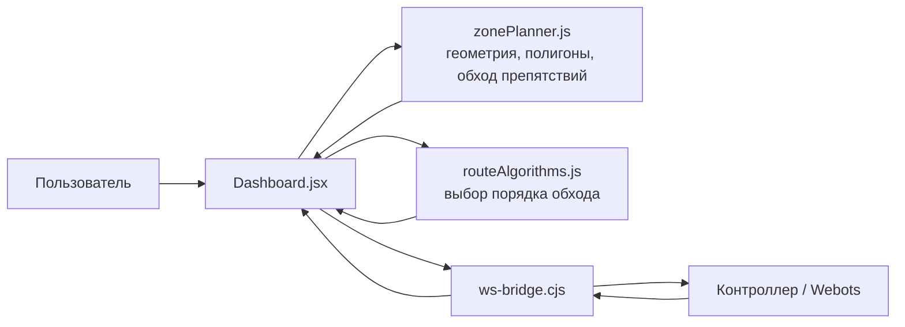

# GPO

[](https://react.dev/)
[](https://vite.dev/)
[](https://tailwindcss.com/)
[](https://developer.mozilla.org/en-US/docs/Web/API/WebSocket)

Интерактивный визуализатор маршрутов для мобильного робота: пользователь ставит точки на карте, рисует несколько ограничивающих зон, выбирает задачу и алгоритм, а приложение строит маршрут с обходом запретных контуров и может отправить его в контроллер через WebSocket.

Проект сделан как практический стенд для связки:

- фронтенд-планировщик на React;
- геометрический модуль проверки зон и обхода препятствий;
- модуль алгоритмов маршрутизации;
- WebSocket-мост к контроллеру робота и телеметрии.

## Схема проекта

Для быстрого и красивого обзора всей архитектуры смотри отдельную страницу:

- [PROJECT_SCHEME.md](./PROJECT_SCHEME.md)

Там вынесены:

- общая схема проекта;
- модульность по файлам;
- жизненный цикл построения маршрута;
- схема обмена данными между UI, логикой и контроллером.

## Что умеет система

| Возможность | Как это работает |
| --- | --- |
| Точки посещения | Красные точки `V1`, `V2`, `V3` задают места, которые робот должен посетить |
| Несколько ограничивающих зон | Можно создать несколько независимых контуров и переключаться между ними |
| Режимы `Открыта / Замкнута` | Пока зона открыта, ее можно редактировать; как только замкнули, она становится препятствием для маршрута |
| Перетаскивание мышкой | Любую точку можно двигать прямо на холсте без пересоздания |
| Автосдвиг точки наружу | Если точка посещения попала внутрь запретной зоны, система автоматически переносит посещение в ближайшую безопасную точку снаружи |
| Обход контуров | Маршрут не просто проверяется на пересечение, а реально перестраивается вокруг замкнутых полигонов |
| Отправка маршрута | Готовый путь отправляется в контроллер через `ws://127.0.0.1:9002/ui` |
| Телеметрия робота | Координаты и угол робота приходят через `ws://127.0.0.1:9001` и отрисовываются на карте |

## Как это выглядит по архитектуре



## Как все работает по шагам

### 1. Пользователь создает карту задачи

На основном экране [Dashboard.jsx](./src/pages/Dashboard.jsx) можно:

- поставить точки посещения;
- создать одну или несколько ограничивающих зон;
- замкнуть контур зоны;
- менять координаты точек перетаскиванием;
- выбрать задачу маршрута и алгоритм.

Вся пользовательская логика сейчас сосредоточена именно в `Dashboard.jsx`: хранение состояния, обработка кликов по холсту, построение маршрута, отправка в WebSocket и отображение статуса соединений.

### 2. Геометрия карты переводится в рабочие структуры

Модуль [src/lib/zonePlanner.js](./src/lib/zonePlanner.js) отвечает за:

- перевод координат между холстом и мировыми координатами;
- проверку, лежит ли точка внутри полигона;
- проверку пересечения отрезков с ограничивающими зонами;
- поиск кратчайшего видимого пути вокруг полигонов;
- отрисовку сетки и служебной графики.

Именно этот модуль превращает набор кликов пользователя в понятные геометрические объекты, с которыми уже можно строить маршрут.

### 3. Точки внутри запретной зоны автоматически исправляются

Если пользователь поставил точку посещения внутрь замкнутого ограничивающего контура, система не ломается и не требует все рисовать заново.

Вместо этого [src/lib/zonePlanner.js](./src/lib/zonePlanner.js) делает следующее:

1. находит ближайшую границу полигона;
2. строит кандидатную безопасную точку снаружи;
3. проверяет, что новая позиция действительно вне запретной зоны;
4. использует уже эту безопасную точку для планирования маршрута.

На карте это видно как связку `Vn -> Sn`:

- `Vn` — исходная точка, которую поставил пользователь;
- `Sn` — безопасная точка, куда реально будет строиться путь.

### 4. Алгоритм определяет порядок обхода точек

Модуль [src/lib/routeAlgorithms.js](./src/lib/routeAlgorithms.js) отвечает за выбор порядка посещения точек.

В проекте есть:

- муравьиный алгоритм `ACO`;
- метод кукушки;
- генетический алгоритм;
- имитация отжига;
- алгоритм рассеивания;
- exact solver для задач, где нужна точная оптимизация.

Поддерживаются задачи:

| Задача | Смысл |
| --- | --- |
| `tsp` | Замкнутый маршрут коммивояжера |
| `hamiltonian_chain` | Незамкнутая гамильтонова цепь |
| `shortest_route` | Кратчайший маршрут с фиксированными концами |

Важный нюанс текущей реализации:

- для `tsp` и `shortest_route` сейчас используется точный решатель;
- пользовательский выбор алгоритма в UI реально влияет прежде всего на `hamiltonian_chain`.

### 5. Маршрут перестраивается с учетом зон

После того как алгоритм дал базовый порядок обхода точек, [src/lib/zonePlanner.js](./src/lib/zonePlanner.js) дополнительно прогоняет каждую пару соседних точек через модуль обхода препятствий.

Логика такая:

1. если отрезок между точками не пересекает зоны, он остается как есть;
2. если пересекает, строится граф видимости по вершинам полигонов;
3. по этому графу ищется кратчайший допустимый путь;
4. итоговый маршрут собирается уже из безопасных сегментов.

То есть система не просто сообщает, что путь плохой, а пытается построить рабочий обход автоматически.

### 6. Маршрут уходит в контроллер, телеметрия приходит обратно

Файл [ws-bridge.cjs](./ws-bridge.cjs) поднимает два WebSocket-сервера:

| Порт | Назначение |
| --- | --- |
| `9001` | Телеметрия от контроллера к UI |
| `9002` | Маршрут от UI к контроллеру |

Поток данных выглядит так:

1. UI строит маршрут;
2. UI отправляет JSON в `ws://127.0.0.1:9002/ui`;
3. `ws-bridge.cjs` пересылает его подключенному контроллеру;
4. контроллер отдает координаты и угол робота;
5. мост ретранслирует телеметрию в UI на `9001`;
6. `Dashboard.jsx` обновляет положение робота на карте.

Пример отправляемого маршрута:

```json
{
  "type": "route",
  "algorithm": {
    "key": "aco",
    "task": "tsp",
    "params": {}
  },
  "route": [
    { "x": -4.2, "y": 3.1 },
    { "x": 1.8, "y": 5.4 },
    { "x": 6.0, "y": -2.7 }
  ]
}
```

Телеметрия может приходить в нескольких форматах, но в итоге фронтенд нормализует ее к виду:

```json
{
  "x": 1.25,
  "y": -0.84,
  "z": 0,
  "yaw": 1.57
}
```

## Структура проекта

```text
.
├── public/
│   └── map.png
├── src/
│   ├── components/
│   ├── lib/
│   │   ├── routeAlgorithms.js
│   │   ├── telemetry.js
│   │   ├── warehousePlanner.js
│   │   └── zonePlanner.js
│   ├── pages/
│   │   ├── Dashboard.jsx
│   │   ├── PathVisualizer.jsx
│   │   ├── RoutePlanner.jsx
│   │   └── TaskEditor.jsx
│   ├── App.jsx
│   └── main.jsx
├── ws-bridge.cjs
├── telemetry-server.cjs
├── package.json
└── README.md
```

На практике основной сценарий запуска сейчас проходит через:

- [src/pages/Dashboard.jsx](./src/pages/Dashboard.jsx)
- [src/lib/routeAlgorithms.js](./src/lib/routeAlgorithms.js)
- [src/lib/zonePlanner.js](./src/lib/zonePlanner.js)
- [ws-bridge.cjs](./ws-bridge.cjs)

## Быстрый старт

### Локальный запуск интерфейса

```bash
npm install
npm run dev
```

После запуска Vite открой адрес из терминала, обычно это:

```text
http://localhost:5173
```

### Запуск WebSocket-моста

Во втором терминале:

```bash
npm run bridge
```

Это поднимет:

- `ws://127.0.0.1:9001` для телеметрии;
- `ws://127.0.0.1:9002` для маршрута.

### Полный сценарий с контроллером

1. запустить `npm run dev`;
2. запустить `npm run bridge`;
3. запустить контроллер робота или Webots-стенд;
4. поставить точки и зоны в интерфейсе;
5. нажать `Построить маршрут`;
6. нажать `Отправить маршрут`.

## Как пользоваться интерфейсом

### Режимы точек

- `Точки для посещения` — то, куда должен приехать робот;
- `Ограничивающий контур` — точки полигона, который робот не должен пересекать.

### Работа с зонами

1. Создать новую зону.
2. Выбрать режим ограничивающих точек.
3. Поставить минимум 3 точки.
4. Нажать `Замкнуть`.
5. При необходимости открыть зону обратно и поправить контур.

### Построение маршрута

1. Добавить точки посещения.
2. Выбрать задачу маршрута.
3. Выбрать алгоритм и его параметры.
4. Нажать `Построить маршрут`.
5. Убедиться, что маршрут не пересекает контуры.
6. Отправить его в контроллер.

## Почему проект полезен

Это не просто “рисовалка маршрутов”, а удобный стенд для экспериментов с робототехникой и алгоритмами:

- можно быстро моделировать препятствия;
- видно, как влияет геометрия на маршрут;
- можно сравнивать задачи и алгоритмы;
- есть прямой мост к контроллеру;
- визуально понятен весь путь от постановки точки до отправки команды.

## Проверка перед коммитом

```bash
npm run lint
npm run build
```

## Что можно улучшать дальше

- сохранение и загрузку карт/зон в `json`;
- привязку точек к сетке или коридорам;
- отдельный режим редактирования вершин полигонов;
- историю запусков алгоритмов и сравнение по длине маршрута;
- визуализацию шагов работы алгоритма в реальном времени.

## Итог

`GPO` — это визуальный планировщик маршрута для робота, где фронтенд, геометрия, алгоритмы и WebSocket-связь собраны в один понятный рабочий цикл:

**поставили точки -> задали запретные зоны -> скорректировали проблемные позиции -> выбрали порядок обхода -> построили безопасный маршрут -> отправили его в контроллер -> увидели телеметрию обратно на карте.**
